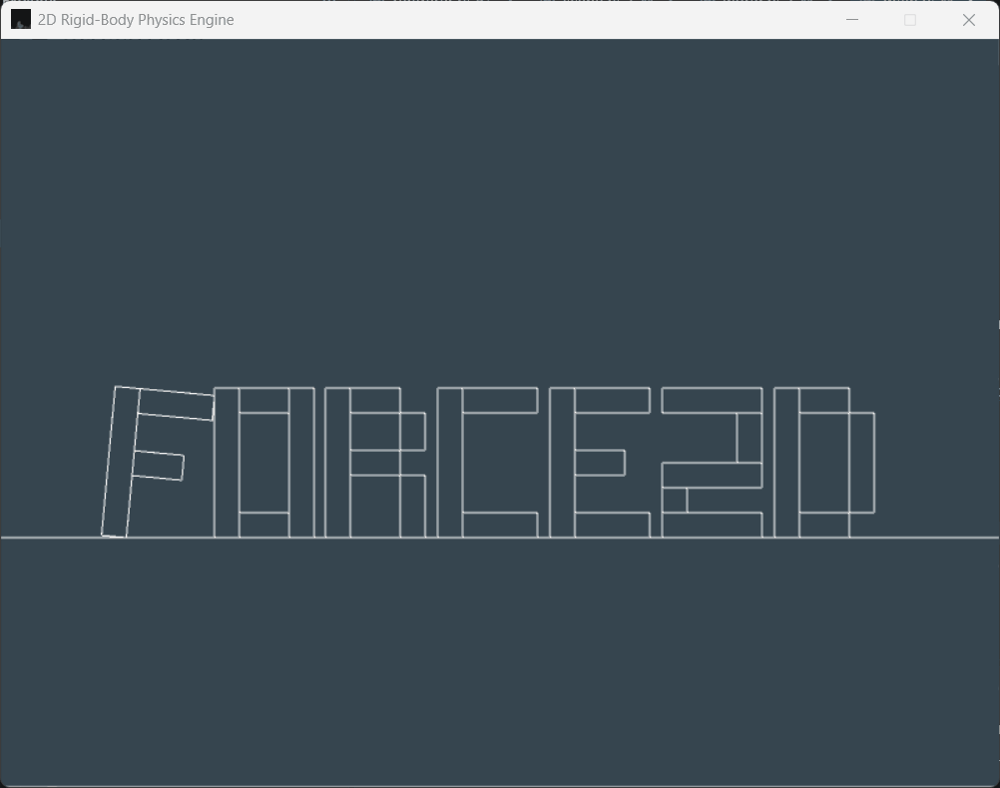

# Force2D - 2D Rigid-Body Physics Engine for Games


-success?style=for-the-badge)

<p align="center">
  
</p>

A high-performance, zero-dependency 2D rigid-body physics engine built entirely from scratch in Rust. 

This project is not a wrapper around existing libraries like Box2D. It is a completely custom implementation designed from the ground up with **Data-Oriented Design (DOD)** principles to maximize cache coherency, eliminate runtime allocations, and provide absolute deterministic stability. The physics core is strictly decoupled from the rendering layer, making it highly portable.

## 🚀 Technical Highlights

### Data-Oriented Design & Zero-Allocation Pipeline
*   **Index-Based Entity Management:** Completely eschews standard OOP paradigms (like `Vec<Box<dyn Shape>>` or VTables). Entities, shapes, and collision pairs are managed in contiguous memory pools using raw indices, ensuring L1/L2 cache-friendly traversal.
*   **Zero-Cost Compound Bodies:** Implements **Intrusive Linked Lists** to attach multiple shapes (Circles, Rectangles, Custom Polygons) to a single RigidBody without allocating heap memory or fragmenting the cache. 

### Advanced Mathematics & Kinetics
*   **Green's Theorem for Arbitrary Polygons:** Automatically calculates the exact geometric area, mass, and local centroid for any arbitrary user-defined convex polygon. It inherently detects and corrects improper vertex winding orders (Clockwise to Counter-Clockwise).
*   **Parallel Axis Theorem:** Analytically computes the precise center of mass (COM) and aggregate moment of inertia for complex Compound Bodies during the initialization phase, guaranteeing physically accurate rotational dynamics.

### Collision Detection Pipeline
*   **Broad-Phase (Dynamic BVH):** Utilizes a Dynamic Bounding Volume Hierarchy tree optimized with the **Surface Area Heuristic (SAH)**. Handles rapid insertions, removals, and tree refitting in $O(\log N)$ time to swiftly cull non-colliding pairs.
*   **Narrow-Phase (SAT & Sutherland-Hodgman):** Implements a robust Separating Axis Theorem (SAT) pipeline capable of resolving `Circle vs Circle`, `Circle vs Polygon`, and `Polygon vs Polygon`. Utilizes the Sutherland-Hodgman algorithm to clip incident edges against reference edges, generating highly accurate multi-point contact manifolds.

### Constraint Resolution
*   **Sequential Impulse Solver:** Solves velocity constraints iteratively.
*   **Warm Starting:** Caches previous frame impulses to converge on the exact solution significantly faster, providing absolute stability for tall stacks of objects.
*   **Baumgarte Stabilization:** Prevents object overlapping and sinking by feeding a portion of the positional error back into the velocity constraint.

## 📊 Performance
The engine is highly optimized for modern CPU architectures. Due to the strict DOD approach and minimal branching, the solver comfortably handles **1,000+ active rigid bodies** (mixing circles, rectangles, and arbitrary polygons) simultaneously at a rock-solid **60 FPS** on a single thread.

<!-- 📸 Insert a stress-test screenshot or GIF here (e.g., a pyramid of 1000 boxes collapsing) -->
> **[stress_test.gif placeholder]**

## 🗺️ Roadmap
The core physics pipeline is feature-complete, but development is ongoing:
- [ ] **Sleeping Islands:** Implement a graph-based sleep management system to entirely bypass integration and collision checks for resting bodies, vastly increasing the upper limit of total objects.
- [ ] **Constraint Joints:** Introduce Distance, Revolute (Hinge), and Mouse joints via generalized Jacobian matrices and Baumgarte bias velocity formulation.
- [ ] **Continuous Collision Detection (CCD):** Implement Time of Impact (TOI) calculations to prevent tunneling of high-velocity objects.

## 🛠️ Getting Started

The core physics engine has **zero dependencies**. The included demo project utilizes [`macroquad`](https://github.com/not-fl3/macroquad) solely for visualization and debug rendering.

### Build and Run the Demo
```bash
git clone [https://github.com/yourusername/rigid-body-physics-engine.git](https://github.com/yourusername/rigid-body-physics-engine.git)
cd rigid-body-physics-engine
cargo run --release
